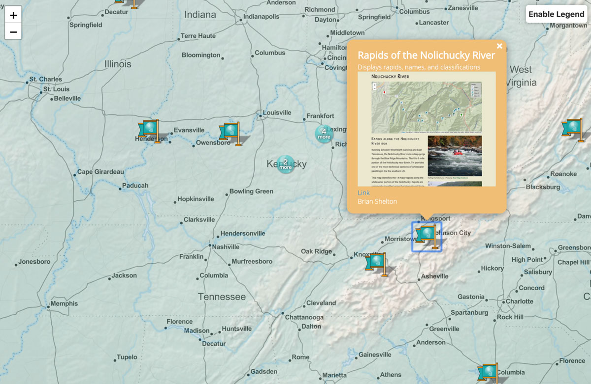

# Web mapping projects with webpage thumbnails

A project to cycle through web mapping projects, generate an image of the project web page, and create a GeoJSON with attributes for informative popups.

    
Example of a project popup

## Process

Many projects have been created by New Maps Plus mappers. Instead of keeping a centralized list of published projects, this repo allows authors to place a pin on a map and maintain their content over time. When an author finishes a project, and wants to contribute to the map, a few steps need to be completed.

1. Create a `publish.json` with the following information: 

  ```js
  {
  "title": "Tile of Project",
  "info": "Secondary information",
  "coordinates": [lat, lon],
  "author": "What's your handle?",
  "link": "URL to project page"
  }
  ```
2. Place the `publish.json` in the root of the GitHub Pages repository. 
3. Submit a GitHub Pages URL to the `publish.json` here: https://forms.gle/W3Cyi1D1dUpAAADZ8. This submission will be added to a [list.json](input/list.json) of URLs.
4. [buildPuppeteer.js](buildPuppeteer.js) is a node script the uses Puppeteer to create a web page screenshot. It also builds a CSV for conversion to GeoJSON. 
5. Each semester we'll run the script to add new projects and modify existing submissions.
6. Kick back and enjoy the show. 🍺🗺️

## Example

New Maps Plus projects: https://newmapsplus.github.io/projects. This is currently a random assortment of final projects from MAP 671 and 672. Some are from the CartoDB days.

## Contributing

If you have any ideas how to improve this project, please feel free to contribute.
